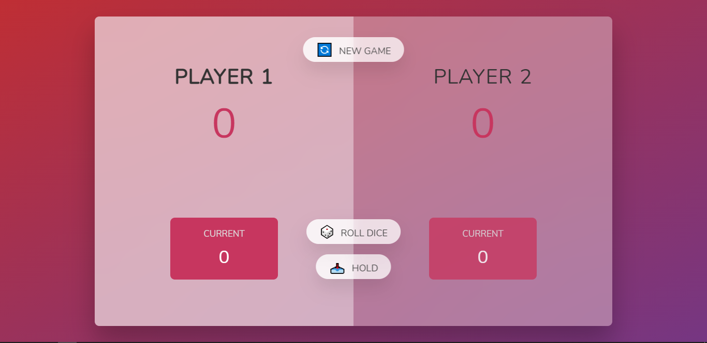

# PIG-GAME

# RULES

1 . The main goal is to reach a score equal or above to a 100.
2 . To play, click on the button named " ROLL DICE ".
3 . To hold your score, click on the button named " HOLD ".
4 . To reset the game, click on the button named " NEW GAME ".
5 . A dice roll of one leads to a loss of the current score so it's better to hold your score earlier 😁.
